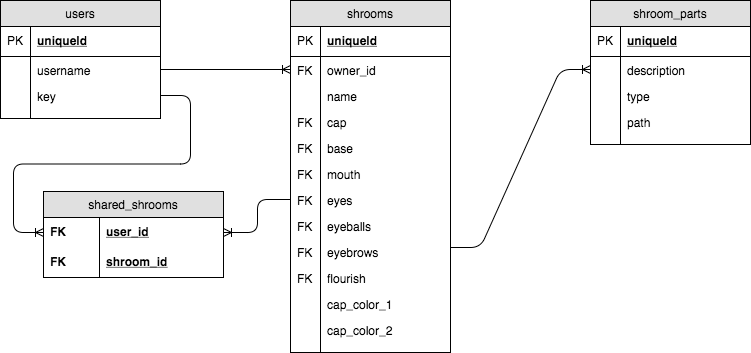

# Moodshrooms (Server)
> A fun website where you can create cartoon mushroom characters called 'Moodshrooms'.
> This is the backend server.

The Moodshrooms server uses Express and a PostgreSQL database to store and process data requests
for the Moodshrooms site.

* Stores the list of Moodshroom parts available to build with.
* Stores all saved Moodshroom characters.
* Stores a user table with only very primitive authentication (I refer to the user secret as a 
    'key' rather than a 'password' intentionally to call attention to this.) These keys are
    plain text and not hashed or anything of the sort. It does, at least, handle authentication 
    server-side, but this still means an un-hashed key will travel to the server via a POST
    request.

## Database Structure

## Installation
1. npm install
### Development
2. createdb moodshrooms_dev
3. npm run knex migrate:latest
4. npm run knex seed:run
5. npm run dev

## Next Steps

- [ ] Add ability to delete users.
- [ ] Possibly add robust security (though there's nothing sensitive about this app).